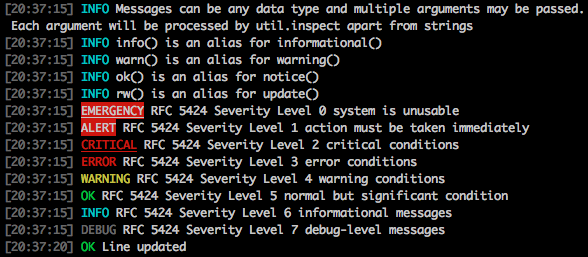

# Logrw [](https://travis-ci.org/jamime/logrw)

Logrw implements the logging levels defined in [RFC-5424](https://tools.ietf.org/html/rfc5424). This module sends all 
messages to `stdout`. Colours are implement to allow easy identification of messages. It is also possible to re-write
the previous message, for example to update severity level.



## Installing
`npm install logrw --save`

## Usage
### Without Timestamps
```javascript
var logrw = new (require('logrw'))();
```

### With Timestamps
```javascript
var logrw = new (require('logrw'))(true);
```

### `logrw.emergency(args...)`
    /**
     * Display an emergency message
     *
     * RFC 5424 Severity Level 0
     * Emergency: system is unusable
     *
     * @param {...*} arguments - The message to display
     */
     
### `logrw.alert(args...)`
    /**
     * Display an alert message
     *
     * RFC 5424 Severity Level 1
     * Alert: action must be taken immediately
     *
     * @param {...*} arguments - The message to display
     */

### `logrw.critical(args...)`
    /**
     * Display a critical message
     *
     * RFC 5424 Severity Level 2
     * Critical: critical conditions
     *
     * @param {...*} arguments - The message to display
     */
     
### `logrw.error(args...)`
    /**
     * Display an error message
     *
     * RFC 5424 Severity Level 3
     * Error: error conditions
     *
     * @param {...*} arguments - The message to display
     */
     
### `logrw.warning(args...)` `logrw.warn(args...)`
    /**
     * Display a warning message
     *
     * RFC 5424 Severity Level 4
     * Warning: warning conditions
     *
     * @param {...*} arguments - The message to display
     */
### `logrw.notice(args...)` `logrw.ok(args...)`
    /**
     * Display a notice message
     *
     * RFC 5424 Severity Level 5
     * Notice: normal but significant condition
     *
     * @param {...*} arguments - The message to display
     */
### `logrw.informational(args...)` `logrw.info(args...)`
    /**
     * Display an informational message
     *
     * RFC 5424 Severity Level 6
     * Informational: informational messages
     *
     * @param {...*} arguments - The message to display
     */
### `logrw.debug(args...)`
    /**
     * Display a debug message
     *
     * RFC 5424 Severity Level 7
     * Debug: debug-level messages
     *
     * @param {...*} arguments - The message to display
     */

### `logrw.update()` `logrw.rw()`
    /**
     * Move the cursor to the previous line.
     *
     * Subsequent output will replace the contents.
     *
     * @return {Logrw}
     */
A new message can be chained for example `logrw.update().info('Replacement message')`

## Contributing
Please use `jshint` to lint your code and follow coding style already in place. Once you are happy with your changes
ensure you have rebased to clean up your commit history before making a pull request. Commits should be on a per-feature
basis where possible.

## Issues?
Please report all issues via github issues providing as much detail and steps to reproduce if possible.

## License
The MIT License (MIT)

Copyright (c) 2015 Jamie Thompson

Permission is hereby granted, free of charge, to any person obtaining a copy
of this software and associated documentation files (the "Software"), to deal
in the Software without restriction, including without limitation the rights
to use, copy, modify, merge, publish, distribute, sublicense, and/or sell
copies of the Software, and to permit persons to whom the Software is
furnished to do so, subject to the following conditions:

The above copyright notice and this permission notice shall be included in
all copies or substantial portions of the Software.

THE SOFTWARE IS PROVIDED "AS IS", WITHOUT WARRANTY OF ANY KIND, EXPRESS OR
IMPLIED, INCLUDING BUT NOT LIMITED TO THE WARRANTIES OF MERCHANTABILITY,
FITNESS FOR A PARTICULAR PURPOSE AND NONINFRINGEMENT. IN NO EVENT SHALL THE
AUTHORS OR COPYRIGHT HOLDERS BE LIABLE FOR ANY CLAIM, DAMAGES OR OTHER
LIABILITY, WHETHER IN AN ACTION OF CONTRACT, TORT OR OTHERWISE, ARISING FROM,
OUT OF OR IN CONNECTION WITH THE SOFTWARE OR THE USE OR OTHER DEALINGS IN
THE SOFTWARE.
